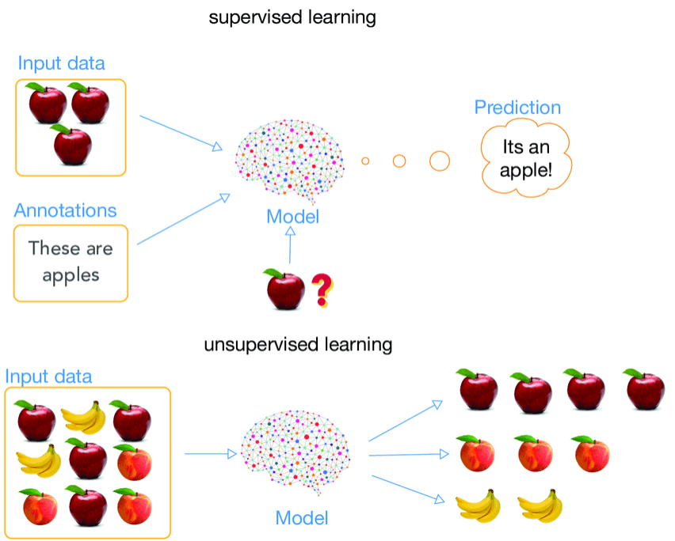
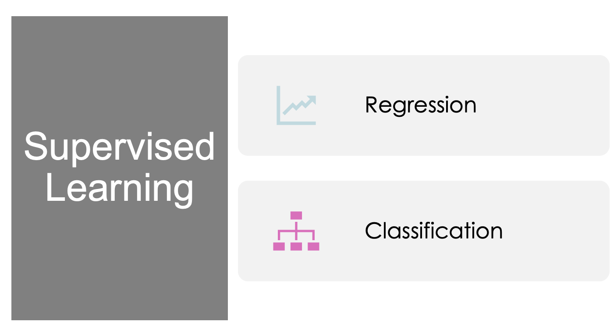
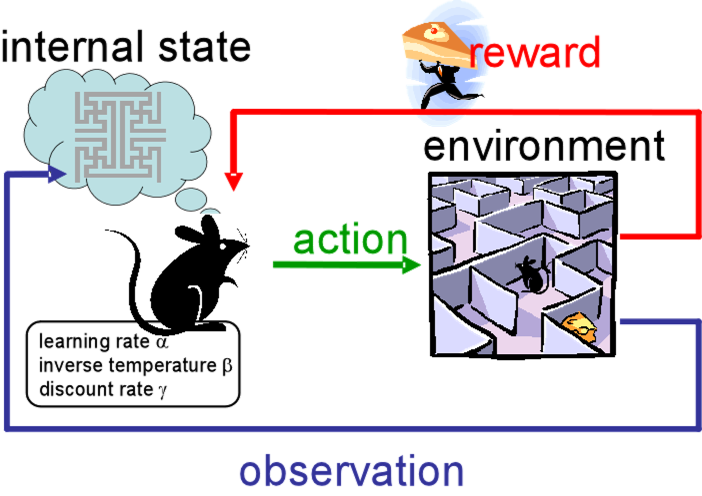
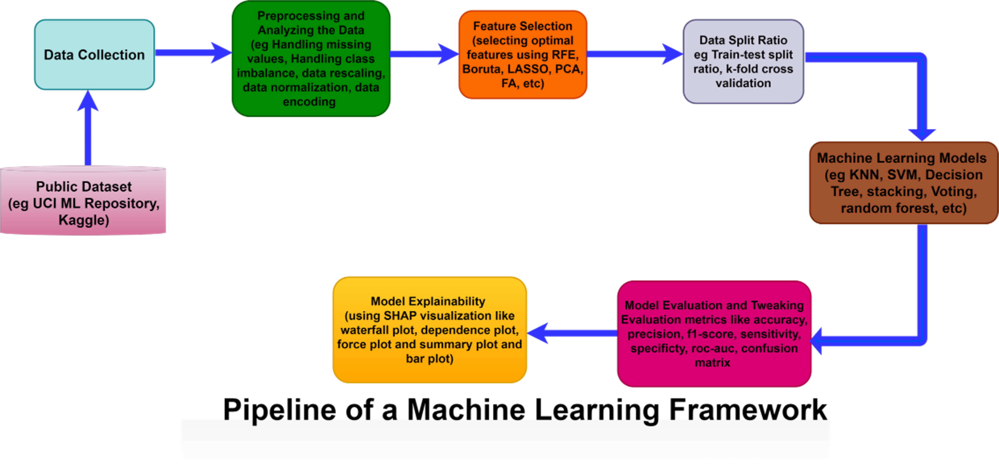

Module Leader: Ahmed Cemiloglu

## Contents

1. Rules
2. Learning outcomes
3. Introduction to Machine Learning
4. Types of Machine Learning
5. Machine Learning Workflow
6. Real-life Applications of ML

## Rules

1. Be on time and ready to participate.
2. Bring the materials you need for the session.
3. Keep phones and unrelated devices away during class activities.
4. Participate actively and ask questions.
5. Prepare for coursework and assessments in good time.
6. Review the lecture materials before and after class.
7. Learn, collaborate, and enjoy the class.

## Learning Outcomes

By the end of this session, you should be able to:
1. Explain the basic idea of machine learning and how it differs from traditional programming.
2. Distinguish supervised, unsupervised, and reinforcement learning.
3. Identify features, labels/targets, samples, and common data types in a dataset.
4. Distinguish classification from regression problems.
5. Explain the purpose of training and testing data and describe the main stages of an ML workflow.

## Introduction to Machine Learning

- Machine Learning (ML) is a branch of Artificial Intelligence (AI) that enables computer systems to learn patterns from data and use those patterns to make predictions or decisions
- Instead of programming every rule explicitly, we provide data and a learning algorithm. The model then learns relationships that can be applied to new, unseen data.
- Examples include spam detection, recommendation systems, medical decision support, and autonomous systems.

---

1. Learning from Data
- ML algorithms identify useful patterns and relationships in data.

2. Learning Instead of Explicit Rules
- In traditional programming, developers specify the rules. In ML, the algorithm learns a model from examples.

Example: For spam detection, we provide examples of spam and non-spam emails. The model learns patterns that help it classify new emails.

- Imagine training a computer to recognize whether an email is spam. Instead of manually writing rules for every possible spam email, we provide the machine with many examples of spam and non-spam emails, and it learns to recognize patterns that are common in spam (such as certain keywords or links).

---

**Real World Importance**

- Helps automate complex or repetitive decision-making tasks.
- Can discover patterns in large datasets that are difficult to identify manually.
- Supports applications such as fraud detection, recommendation systems, predictive maintenance, and healthcare decision support.

## Types of Machine learning

### Supervised Learning

In supervised learning, a model learns from labeled examples. Each example contains input features (X) and a known target or label (y). The goal is to learn a relationship that can be used to predict the target for new data.

Example: Predicting a house price from size, number of rooms, and location.

Supervised learning includes two major problem types: regression and classification.

-  Process: The machine is "supervised" during training by being given both the input and the correct output (label). It learns from the correct answers, similar to how a student learns from a teacher.

#### Supervised Learning - Regression Example

Predict a future stock price
- Input: historical market information
- Output: a continuous numerical value (e.g., future price)

#### Supervised Learning - Classification Example

- Classification predicts a discrete class or category.

Example: Face recognition
- Input: an image containing a face
- Output: one of several predefined identities/classes 
- James / Sara / Jack / Susan

Other examples: spam/not spam, disease/no disease, activity type.

### Unsupervised Learning

The machine is given input data without any labeled outputs. The machine has to find patterns and relationships in the data on its own. This is typically used for tasks like grouping similar items together (clustering).

In unsupervised learning, the data do not contain a known target label. The goal is to discover useful structure or patterns in the data.

Example: Customer segmentation, where customers are grouped according to similarities in their behavior or characteristics.

-  Process : The machine learns without any "supervision" and tries to organize the data based on similarities or differences.

A common unsupervised task is clustering.

### Reinforcement Learning

The machine learns by interacting with an environment and receiving rewards or penalties based on its actions. The goal is to maximize the reward over time by learning the best actions to take in different situations.
-  Example: Training a computer to play a game like chess or Go, where the machine gets positive feedback (rewards) for winning and negative feedback (penalties) for losing. 
-  Process: It is like learning from experience, where the machine learns by trial and error to achieve the best outcome.

|                       | Input | Output |
| --------------------- | ----- | ------ |
| Supervised Learning   | ✓     | ✓      |
| Unsupervised Learning | ✓     | ✕      |

## Machine Learning Workflow

### Machine Learning Framework

Machine Learning Framework is mainly composed of phases associated with data retrieval and extraction, preparation, modeling, evaluation, explainability  and deployment.

### Machine Learning Workflow

A machine learning project usually follows a sequence of connected stages:
1. Collect and understand the data
2. Prepare and explore the data
3. Select or transform useful information
4. Split the data into training and testing sets
5. Train a machine learning model
6. Evaluate and improve the model
7. Interpret and use the results

<u>Note: Week 1 gives you the overall map. We will study these stages in detail throughout the module.</u>

### Understanding a Dataset

- A dataset is a collection of observations used for analysis and machine learning.
- Sample / observation: one row representing one case, person, object, event, etc.
- Feature / Input: an input variable used to describe each sample.
- Target / label: the output variable we want to predict in supervised learning.

<u>Before building a model, always ask: What does each row represent? What do the columns mean? Which column is the target?</u>

### Features and Target: Simple Example

Suppose we want to predict whether a student will pass a course:

| Hours Studied | Attendance (%) | Previous Mark | Pass |
| ------------- | -------------- | ------------- | ---- |
| 5             | 90             | 72            | Yes  |
| 2             | 65             | 55            | No   |
| 7             | 95             | 81            | Yes  |

**Features / Input (X): Hours Studied, Attendance, Previous Mark**  
**Target / label (y): Pass**

Because the target is a category (Yes/No) which problem is this and why??

### Training and Testing Data

A model should be evaluated on data it did not use for learning.  
**Training set: used by the algorithm to learn patterns and model parameters.**  
**Testing set: kept separate and used to evaluate performance on unseen data.**

A common introductory split is 80% training and 20% testing, although the appropriate split depends on the dataset and task.

**Key idea: the test set should not be used to train the model.**

### Why Do We Split the Data?

Training performance alone does not tell us how well a model will work on new data.  
**Training data → learn the model**  
**Testing data → evaluate the learned model on unseen examples**  
This helps us assess generalization: the ability to perform well beyond the data used for training.  

<u>Later in the module, we will study cross-validation and more advanced evaluation strategies.</u>

### Choosing a Machine Learning Approach

The type of problem determines the kind of learning approach we use.

**Classification: predict a category or class.**

**Regression: predict a continuous numerical value.**

**Clustering: discover groups or structure without a known target label.**  
Different algorithms can solve the same problem. In later weeks, we will learn how these algorithms work and how to compare them.

### Quick Check

::: collapse
- 1.&nbsp;Predicting the selling price of a house: classification or regression?

  Predicting the selling price of a house: **Regression**, because we predict a continuous numerical value (house price).

- 2.&nbsp;Predicting whether an email is spam: classification or regression?

  Predicting whether an email is spam: **Classification**, because we predict a discrete category (spam or not‑spam).

- 3.&nbsp;Grouping customers with similar purchasing behavior: supervised or unsupervised learning?

  Grouping customers with similar purchasing behavior: **Unsupervised learning**, since there are no predefined labels and we group data by similarity (clustering task).

- 4.&nbsp;In a dataset, what is the difference between a feature and a target?

  A **feature** is input descriptive information used to describe each sample. A **target (label)** is the output variable we aim to predict in supervised learning.

- 5.&nbsp;Why should testing data be kept separate from training data?

  We use the unseen test set to evaluate the **generalisation ability** of the model. It checks how well the model performs on new real‑world data, rather than only memorizing patterns from training data.

:::

## Real-World Applications of Machine Learning

### Real-life Applications

1.  **Healthcare:**
    -  Use Case: ML helps in medical diagnosis by analyzing patient data to detect diseases earlier or more accurately than humans. It’s also used in personalized treatment plans by analyzing patient history.
    -  Example: Analyzing medical images (such as X-rays) to detect anomalies like tumors with higher accuracy than human radiologists.
2.  **Finance:**
    -  Use Case: Banks and financial institutions use ML to detect fraudulent transactions in real-time by analyzing patterns in transaction history.
    -  Example: Credit card companies automatically flag suspicious activities (such as unusual spending) for further review based on machine learning models.
3.  **Marketing and E-commerce:**
    -  Use Case: ML helps companies personalize their marketing strategies by predicting customer preferences and suggesting products.
    -  Example: Baidu, Netflix and Amazon use recommendation algorithms to suggest movies and products based on user behavior.
4.  **Self-Driving Cars:**
    -  Use Case: ML algorithms are used to analyze sensor data (e.g., from cameras and radar) to help autonomous vehicles navigate, avoid obstacles, and make driving decisions.
    -  Example: Tesla’s Autopilot system uses machine learning to detect lanes, cars, and pedestrians.

Source: [mlweek1lecture.pptx](https://view.officeapps.live.com/op/view.aspx?src=https%3A%2F%2Fvle.zycdut.net%2Fsites%2Fstudent.zy.cdut.edu.cn%2Ffiles%2Fattachments%2Fmlweek1lecture.pptx&wdOrigin=BROWSELINK)
