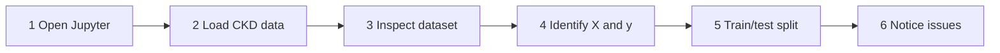
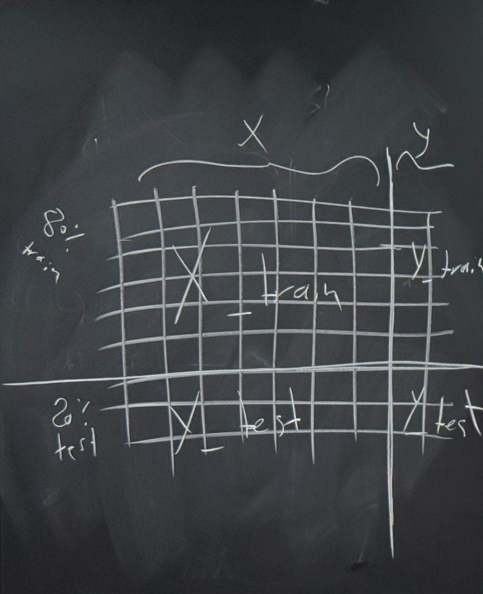

## Seminar Learning Outcomes

- Open and run a Jupyter notebook in the module environment.
- Load a CSV dataset using pandas.
- Inspect the structure of a machine learning dataset.
- Identify samples, features and the target variable.
- Separate the dataset into X (features) and y (target).
- Create a basic training/test split and explain why it is used.
- Recognize data-quality issues that we will solve in Week 2.

## Today’s Practical Workflow

> Week 1 focuses on understanding the data, not cleaning it.



### Step 1: Open Jupyter

- Open Anaconda Prompt/Terminal.
- Activate the module environment:
- Launch JupyterLab (or classic Notebook).

```bash
conda activate ml_chc6089
jupyter lab
jupyter notebook
```

### Step 2: Load the CKD Dataset

> Dataset file: `chronic_kidney_disease.csv`

```python
import pandas as pd
df = pd.read_csv("chronic_kidney_disease.csv")
df.head()
```

- pandas is used for tabular data.
- `read_csv()` loads the CSV file into a DataFrame.
- `head()` shows the first five rows.

#### What Does This Dataset Contain?

| age  | bp   | sg    | al  | htn | dm  | classification |
| ---- | ---- | ----- | --- | --- | --- | -------------- |
| 48.0 | 80.0 | 1.02  | 1.0 | yes | yes | ckd            |
| 7.0  | 50.0 | 1.02  | 4.0 | no  | no  | ckd            |
| 62.0 | 80.0 | 1.01  | 2.0 | no  | yes | ckd            |
| 48.0 | 70.0 | 1.005 | 4.0 | yes | no  | ckd            |

- Each row is one patient/sample.
- Columns describe patient measurements or conditions.
- classification is the target we want to predict.

### Step 3: Inspect the Dataset

```python
df.shape
df.columns
df.info()
```

- Shape: 400 rows × 26 columns.
- shape tells us the dataset size.
- columns lists the available variables.
- info() shows data types and non-null counts.

#### Samples, Features and Target

<div style="overflow-x:auto; width:100%;">
  <div style="display:flex; gap:20px; min-width:max-content;">
    <!-- Samples Box -->
    <div style="flex:0 0 420px; border:3px solid #4285d4; border-radius:24px; background:#edf4fc; padding:40px 20px; text-align:center;">
      <h1 style="color:#203864; font-size:32px; margin:0; font-weight:bold;">Samples</h1>
      <p style="color:#4285d4; font-size:22px; margin:4px 0 16px; font-weight:bold;">Rows</p>
      <p style="color:#222222; font-size:18px; margin:0;">Patients in this dataset</p>
    </div>
    <!-- Features X Box -->
    <div style="flex:0 0 420px; border:3px solid #4285d4; border-radius:24px; background:#edf4fc; padding:40px 20px; text-align:center;">
      <h1 style="color:#203864; font-size:32px; margin:0; font-weight:bold;">Features (X)</h1>
      <p style="color:#4285d4; font-size:22px; margin:4px 0 16px; font-weight:bold;">Input columns</p>
      <p style="color:#222222; font-size:18px; margin:0;">age, bp, sg, al, ...</p>
    </div>
    <!-- Target y Box -->
    <div style="flex:0 0 420px; border:3px solid #4285d4; border-radius:24px; background:#edf4fc; padding:40px 20px; text-align:center;">
      <h1 style="color:#203864; font-size:32px; margin:0; font-weight:bold;">Target (y)</h1>
      <p style="color:#4285d4; font-size:22px; margin:4px 0 16px; font-weight:bold;">Output to predict</p>
      <p style="color:#222222; font-size:18px; margin:0;">classification</p>
    </div>
  </div>
</div>

- Question: Is this a classification or regression problem? Why?

### Step 4: Create X and y

```python
X = df.drop(columns=["classification"])
y = df["classification"]
print(X.shape)
print(y.shape)
```

- X contains the input features.
- y contains the class label.
- We keep them separate because the model learns a mapping from X to y.

### Step 5: Training and Testing Data

```python
from sklearn.model_selection import train_test_split
X_train, X_test, y_train, y_test = train_test_split(X, y, test_size=0.20, random_state=42)
```



<div style="width:100%; background:#3377bb; border-radius:6px; overflow:hidden; box-shadow:0 2px 4px rgba(0,0,0,0.2); display:flex;">
  <div style="width:80%; background:#3377bb; color:#ffffff; font-size:32px; font-weight:bold; text-align:center; padding:30px 0;">
    80% Training
  </div>
  <div style="width:20%; background:#2e7d32; color:#ffffff; font-size:32px; font-weight:bold; text-align:center; padding:30px 0;">
    20%
  </div>
</div>

- Training data: used to learn.
- Test data: kept separate for later evaluation.

## Do You Notice Any Data Problems?

> Do not fix them yet. First, learn to recognise them.

```python
df.isnull().sum()
df.dtypes
df["classification"].value_counts()
```

- Are any values missing?
- Are all columns numeric?
- Are categories written consistently?
- Are the target classes balanced?
- Could some columns need scaling or encoding?

## Week 1 vs Week 2

<div style="overflow-x:auto; width:100%;">
  <div style="display:flex; gap:30px; min-width:max-content;">
    <!-- Week 1 Box -->
    <div style="flex:0 0 400px; border:3px solid #4285d4; border-radius:32px; background:#edf4fc; padding:40px 35px;">
      <h2 style="color:#203864; font-size:24px; margin:0 0 24px; font-weight:bold;">Week 1: Understand the Data</h2>
      <ul style="font-size:17px; color:#111; padding-left:30px; margin:0; line-height:1.6;">
        <li>Load the dataset</li>
        <li>Inspect rows and columns</li>
        <li>Identify features and target</li>
        <li>Create X and y</li>
        <li>Create train/test split</li>
      </ul>
    </div>
    <!-- Week 2 Box -->
    <div style="flex:0 0 400px; border:3px solid #999; border-radius:32px; background:#f7f7f7; padding:40px 35px;">
      <h2 style="color:#203864; font-size:24px; margin:0 0 24px; font-weight:bold;">Week 2: Prepare the Data</h2>
      <ul style="font-size:17px; color:#111; padding-left:30px; margin:0; line-height:1.6;">
        <li>Handle missing values</li>
        <li>Clean inconsistent values</li>
        <li>Encode categories</li>
        <li>Scale/normalise features</li>
        <li>Explore distributions and imbalance</li>
      </ul>
    </div>
  </div>
</div>

## Seminar Task

- Run all Week 1 notebook cells successfully.
- Write down the dataset shape.
- Identify the target variable.
- List three numerical and three categorical features.
- Explain whether the problem is classification or regression.
- Record at least three data-quality issues you notice.
- Do not clean the dataset yet — bring your observations to Week 2.

<center>Next week: Data Preprocessing and Exploration</center>

Interactive Python Notebook: <a href="/obu/level6/machine-learning/week1/machine-learning_week1_seminar.ipynb" download>machine-learning_week1_seminar.ipynb</a>

Source: [week1seminar.zip](https://vle.zycdut.net/sites/student.zy.cdut.edu.cn/files/attachments/week1seminar.zip)
