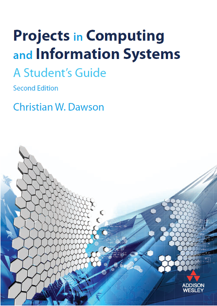

## About Module Leader

- I’m Joojo Walker
- I’m a Ghanaian
- I have been living in Chengdu since 2016
- Pursued MEng. and Ph.D. at UESTC
- <b>Research Area</b>: *Deep Learning and Generative AI and it application to Information Systems, Recommender Systems, Educational Technologies, Energy, Information Security etc.* 

## Contact Information

- Dr. Joojo Walker
- Room: 8206-16
- Email: joojo.walker@zy.cdut.edu.cn
- Office hours: By appointment

## Lecture Outline

- Project Aims and Contents
- Project Timelines
- Module Lecture Schedule
- Generative AI Usage
- Topic Selection and Supervision
- Project Management
- Handbook & Assessment Overview
- Questions Time
- Concluding Remarks

## Aims of the Project Module

- An individually supervised project to investigate a chosen problem to form an extended study of a topic selected from a suitable area of the student’s program of study and that involves the solution of a practical problem.
- Examples:
    - Design of a Project Topic Selection System
    - Design of a Breast Cancer Detection System
    - Design of a Product Recommendation System
- Conforms to the appropriate university codes of practice and ethical requirements.

## Project Contents

- Substantial topic related to your BSc course
- Guided by the BCS (the Chartered Institute for IT) requirements (see Handbook)
    - ability to apply practical and analytical skills
    - innovation and/or creativity
    - synthesis of information, ideas, and practices to provide a quality solution with the evaluation of that solution
    - the project meets a real need in a wider context
    - ability to self-manage a significant piece of work
    - critical self-evaluation of the process
- Consideration of Professional Issues: risk, legal, social, ethical, and environmental

## List of Deliverables

- <u>You will be assessed on the PROCESS as well as the DELIVERABLES</u>
- Must generate deliverables such as: 
    - Project proposal: a detailed description of the work to be done.
    - Ethics Forms: documents to help you reflect on the ethical implications of your project.
    - Progress report: a report of your project progress submitted at the end of semester 1.
    - Implemented Project: substantial technical artifact produced according to a suitable methodology.  
    - Final Project Report (“Dissertation”): a detailed report on your specific topic.
    - Oral Presentation documents: PowerPoint slides or poster file.
    - Weekly reports: a weekly report of your progress. It is designed to enhance with student-supervisor communication.

## Project Timelines

- Two-semester course (30 credit module)
- Contact Hours:
    - Semester One & Two - Weekly lectures (1.5 hours) and supervision (1 hour)
- Independent Study: 282 hours
    - 192 hours Directed/Independent Study
    - 90 hours Preparation for Assessments

---

### Semester One

- Project Proposal and Ethics Form (Week 6) – November 13, 2026 (MUST BE PASSED TO PROGRESS)
- Progress Report (January 8, 2027)
- **Feedback**: Your supervisor will provide formative feedback on these two components, which you should use to improve your final report. These also contribute to your Code of Conduct mark (Professional Conduct Score).

### Semester Two

- Final Report (**Includes Professional Conduct Score**) - 10000 words (Week 7/8) 90% - April 30, 2027
- Presentation – Demonstration & Oral presentation of implemented results (Week 11-12) 10% - June 1st to 3rd 2027
- Tech Show – a showcase for the best projects (Week 13) - June 4, 2027

## Module Lecture Schedule

### Semester One Schedule

| Week | Topics                                                                                        | Activity                                   | Deliverables to submit & Deadlines                         |
| ---- | --------------------------------------------------------------------------------------------- | ------------------------------------------ | ---------------------------------------------------------- |
| 1    | Project Introduction and General Requirements                                                 | 1 hour lecture & 1 hour supervision period |                                                            |
| 2    | Project Proposal Writing, Ethics Form &  Project Management                                | 1 hour lecture & 1 hour supervision period |                                                            |
| 3    | Literature Search & Organization, Referencing &  Avoiding Plagiarism                       | 1 hour lecture & 1 hour supervision period | Weekly Report 1                                            |
| 4    | Literature Reviews & Critical Thinking                                                        | 1 hour lecture & 1 hour supervision period | Weekly Report 2                                            |
| 5    | Ethical Use of AI for Project Module Question & Answer Session                             | 1 hour lecture & 1 hour supervision period | Project Proposal Ethics Form E1/E2 Plagiarism Report |
| 6    | Project Version Control                                                                       | 1 hour lecture & 1 hour supervision period | Weekly Report 3                                            |
| 7    | Testing of Project                                                                            | 1 hour lecture & 1 hour supervision period | Weekly Report 4                                            |
| 8    | Progress Report  writing                                                                      | 1 hour lecture & 1 hour supervision period | Weekly Report 5                                            |
| 9    | Risk & Professional issues                                                                    | 1 hour lecture & 1 hour supervision period | Weekly Report 6                                            |
| 10   | Final Report Writing                                                                          | 1 hour lecture & 1 hour supervision period | Weekly Report 7                                            |
| 11   | Oral Presentation Preparation & Presentation Module Question & Answer Session              | 1 hour lecture & 1 hour supervision period | Weekly Report 8                                            |
| 12   | Employability - Impact of Projects on job acquisition &  postgraduate education admission. | 1 hour lecture & 1 hour supervision period | Progress Report Plagiarism Report                       |

### Semester Two Schedule

| Week  | Topics                                                                        | Activity                                   | Deliverables to submit & Deadlines        |
| ----- | ----------------------------------------------------------------------------- | ------------------------------------------ | ----------------------------------------- |
| 1     | Project Supervision                                                           | 1 hour supervision period                  | Weekly Report 9                           |
| 2     | Module Information Session – Project Implementation                           | 1 hour lecture & 1 hour supervision period | Weekly Report 10                          |
| 3     | Project Supervision                                                           | 1 hour supervision period                  | Weekly Report 11                          |
| 4     | Module Information Session – Final Report &  Oral Presentation Preparation | 1 hour lecture & 1 hour supervision period | Weekly Report 12                          |
| 5     | Project Supervision                                                           | 1 hour supervision period                  |                                           |
| 6     | Submission of Final Report                                                    |                                            | Final Project Report Plagiarism report |
| 7-11  | Final Report Marking by Internal assessors & supervisors                      |                                            |                                           |
| 12-13 | Project Demonstration & Oral Presentation                                     |                                            | Oral Presentation Files                   |

## Reading Resources

- Dawson, C. W., Projects in Computing and Information Systems: A Student’s Guide, 2nd or 3rd Edition, Person Edition, 2009 (2015). (2nd Edition is available on the student website)
- <b>Relevant articles and books are available via repositories such us: ACM Digital Library, IEEE Xplore Library, etc.</b> See section 7.2 of the module handbook for more details on other Library resources available.

## Generative AI Usage

- AI can provide learning opportunities if used cautiously, critically and reflectively.
- If you provide clear and accurate prompts to ChatGPT, you are more likely to get responses that are relevant and appropriate for your needs. When used responsibly, ChatGPT can support your learning, your research, and your writing, and ensure that the ideas and arguments presented in your assignments reflect your own understanding of the subject.

Use AI with CAUTION (a useful acronym):
- Check your prompts. The information you get out is only as good as the requests
- Approach any information the AI tool produces cautiously (be a critical reader).
- Understand that Large Language Models (including ChatGPT, Deepseek) are designed only to predict and generate texts.
- Take the time to verify any claims made and check the reliability of any sources.
- Identify any use of AI tools (including large language models such as ChatGPT, Deepseek) in the student declaration form (below). Always declare your use of AI tools and explain how you used them.
- Observe the principles of Good Academic Practice at all times.
- Never submit chunks of text produced by AI as your own work. You may be in breach of the academic conduct regulations.

## Topic Selection

- Topics:
    - Choose a topic that interests you, perhaps related to your student experience or a hobby.
    - Choose a topic proposed by a supervisor (the list will be sent out later this week).
    - Choose a topic linked to your preferred career or placement.
        - Web Application Developer: *“Design of an Educational Web Application System”*
        - Machine Learning System Developer: *“Design of a Face Mask Detection System”*

## How to Choose Your Topic

:::steps{title=""}

1. Start with a broad idea

   Example: Building a Web Application

2. Narrow it down

   Specific kind of web application: Hospital Management System, Educational Application etc.

3. Further narrow it down and settle on a proposed topic

   Proposed Topic: Design and implementation of an Educational Application for College Students

:::

---

:::steps{title=""}

1. Start with a broad idea

   Example: Building Machine Learning/ Deep Learning Models

2. Narrow it down

   Specific kind of application area: Recommendation system, computer vision, sentiment analysis etc.

3. Further narrow it down and settle on a proposed topic

   Proposed Topic: Design and implementation of an RNN based Recommendation System

:::

## Important Suggestions

- You can change your mind, but try to crystallize your ideas as soon as possible. 
- Suggestions:
    - Thoroughly review the staff project topics excel file.
    - Discuss with the module leader / potential supervisor.
    - Perform a competitive analysis, e.g., make a software feature list of a small selection of similar software.
    - Conduct a literature review.
    - Survey potential users (ideal, but can be time-consuming).

## Supervisor Selection

- Supervision
    - Each student would be assigned a supervisor.
    - Supervisors will have many students to guide.
- Supervisors will be assigned according to preferences where possible. See staff interests and proposed topics in the "<b>2025-2026-project-topics-list-supervisors</b>" excel file on the student website.
- If you are unsure of <u>whom to choose or the topic to select</u>, discuss it with me, the module leader.
- Supervisor allocation is subject to multiple constraints, so it is very difficult to change.

## Role of Supervisor

- Advise on the scope of the dissertation
- Assess the level of work required
- May suggest literature
- Provide feedback on a technical level and draft versions of parts of written reports
- Advise about managing the timetable of project activities

<i>It is not the supervisor’s role to manage the dissertation or the student's time or to motivate the student. The student should manage his or her time, do the work, and write the dissertation.</i>

## Supervision: How to Get the Most of Your Supervisor

- Agree on a timetable of weekly meetings and stick to it
- Each meeting should have a focus of your choice
- Prepare for the meeting – record what you worked on, what progress you made, based on the action points from the last meeting, what you want feedback on
- At the end of each meeting, agree on action points
- Keep a record of the meetings: it will help you to present accurate weekly reports to your supervisor. (Logbook: Digital records – Use my suggested excel template)
- Submit your weekly report (the weekly reports template is on the students’ website) to be signed by the supervisor.
- Be committed to the meetings with your supervisor.

## Project Management

- Data management:
    - What kind of data will the student manage?
        - Requirements or user stories; sprint plans/ literature reviews etc.
        - Testing documentation.
        - Reports: proposal, interim, final project reports, and poster files 
    - How can students manage their project files/progress?
        - Use Baidu cloud services to store your project files
        - Log Book: Records the day-to-day events such as strategic decisions, references to articles and other work and literature searches, practical design considerations, experimental data, useful addresses, etc.
        - Weekly Reports sheets: A brief report on your progress, challenges, and next steps.
- Software / Project Code version management (e.g., Git, Baidu Cloud, or other tools)

## Do's and Don't

<u>DO</u>
- Get started straight away
- Make a plan of your time and weekly goals
- Contact your supervisor
- Aim to have something designed by Week 10

<u>DON’T</u>
- Worry if you haven’t got a topic or want to change
- Plan something unachievable in the time, or think that you must be too original
- (Example: Building a new generation “Taobao” that is better than the existing one)
- Go into denial if you start to fall behind

## Handbook Overview

- All sections of the student handbook are significant.
- Key Assessment Information
    - Appendix A Project Proposal Requirements & Marking Rubric
    - Appendix B Progress Report Requirements & Marking Rubric
    - Appendix C Presentation Requirements & Marking Rubric
    - Appendix D Final Report Requirements & Marking Rubric
    - Appendix E BCS Project requirements
    - Appendix D Weekly Report Descriptions & Marking Rubric

## Proposal Requirements  See Handbook Appendix A

- <b>Length = 1000 – 1500 words. Numbered sections</b>
- **Introduction**
    - Background; Aim; Objectives; Product Overview
- **Background Review**
    - Summary of existing approaches and literature
- **Methodology**
    - Approach; Technology; Version management plan
- **Project management**
    - Activities; Schedule; Data management plan; Deliverables
- **Bibliography**

## Checklist for Weeks 1 - 5

1. Choose your topic
2. Set up a schedule to meet your supervisor every week
3. Conduct background research (search competitors; literature search, read around the subject)
4. Plan your project (aim, objectives, activities, deliverables)
5. Create a schedule for the plan (i.e., Gantt chart)
6. Define the Methodology (and version management)
7. Organize your data (project logs, literature, etc.)
8. Submit Ethics forms
9. Submit Proposal

## Next Steps

1. Download the course resources such as the Handbook, lecture slides etc.
2. Choose a topic
3. Familiarise yourself with Appendix A (Proposal Requirements)
4. Look at the Project Examples
5. Contact and meet your supervisor
6. Plan your time: Very Important!
7. Keep organized notes of everything: e.g., papers you find, list of links, notes on why you kept things.
8. Enjoy your project!

## Concluding Remarks

- You can choose your own topic or choose from the list of topics suggested by staff members (supervisors).
- Effective project management will ensure your success in this module.
- Module Handbook has several important details about all the deliverables that must be submitted, assessment details, marking schemes, etc.
- Refer to the topics database and think about a suitable topic for your project.
- All students must decide on your <u>probable topic and supervisor</u> before our next class.

Source:
- [lecture-1-projectschc-6096.pptx](https://view.officeapps.live.com/op/view.aspx?src=https%3A%2F%2Fvle.zycdut.net%2Fsites%2Fstudent.zy.cdut.edu.cn%2Ffiles%2Fattachments%2Flecture-1-projectschc-6096_3.pptx&wdOrigin=BROWSELINK)
- [2026-2027-project-module-guide.pdf](https://vle.zycdut.net/sites/student.zy.cdut.edu.cn/files/attachments/2026-2027-project-module-guide.pdf)
