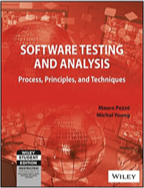
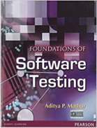
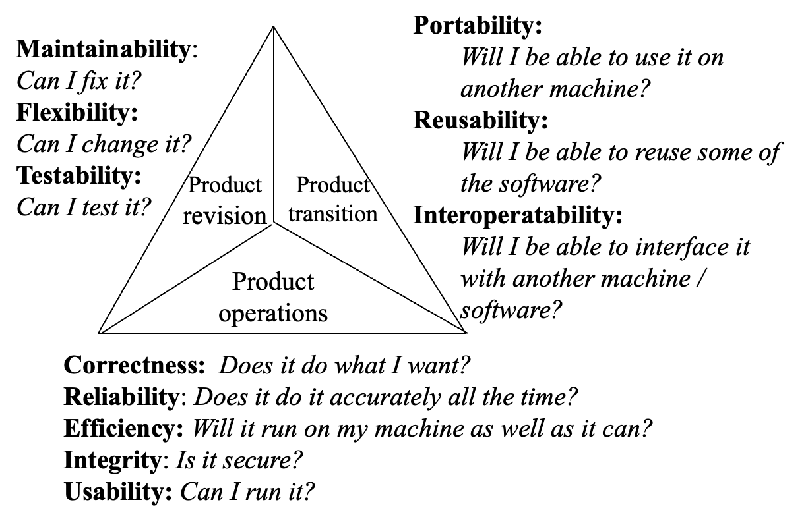
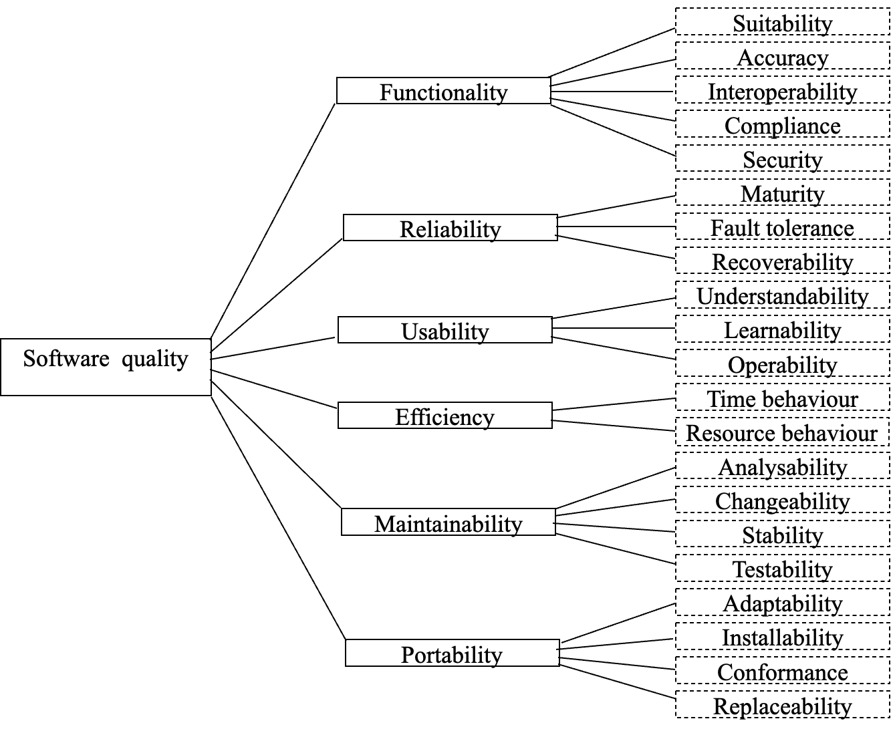
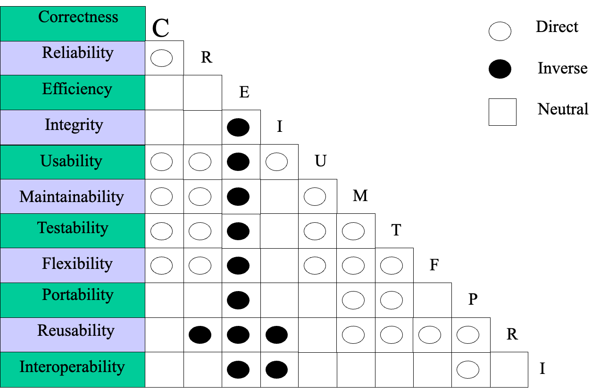
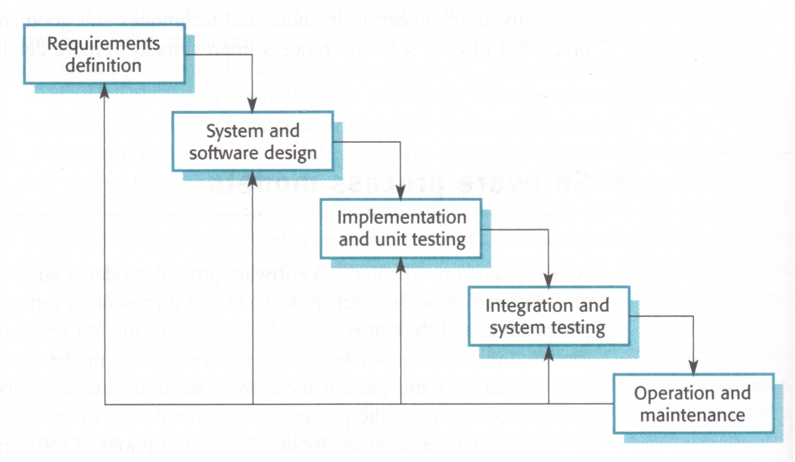
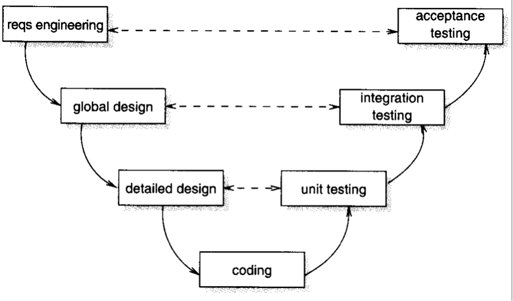
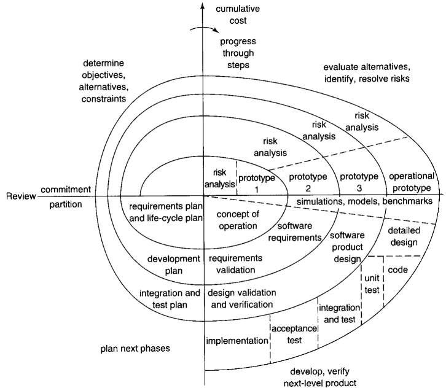

<!-- # Week 1 Introduction – Lecture -->

## Outline of Lecture

- Teacher introduction
- Software Quality Models
- Software Process Models
- Some SAT techniques and methods

## Teacher introduction

- Lecturer & Seminar: <b>Albert Xu</b>
- Email: albert.xu@zy.cdut.edu.cn
- Office and Office Hours: 8102, Monday to Friday by appointment only

## Learning Outcomes

|     | On successful completion of this module, students will be able to:                                                                                                                                                                                           | Brookes attribute developed* | Other GAs developed, if applicable |
| --- | ------------------------------------------------------------------------------------------------------------------------------------------------------------------------------------------------------------------------------------------------------------ | ------------------------------------------------------------ | ---------------------------------- |
| 1   | Create effective software test plans to demonstrate an understanding of the principles and theoretical foundations of software quality assurance processes and systems,  and software quality assurance methodologies, models and techniques                 | Academic Literacy                                            |                                    |
| 2   | Evaluate the strengths and weaknesses of different approaches, based on the theoretical foundations of software measurement and metrics and select and apply appropriate metrics in the context of software creation                                         | Academic Literacy                                            | Research Literacy                  |
| 3   | Understand the theoretical foundations of software testing, both static and dynamic, manual and automated; understand the range of applicability of different approaches and techniques, and select and apply appropriate techniques in practical situations | Academic Literacy                                            |                                    |
| 4   | Design and conduct systematic experiments, using both quantitative and qualitative methods; collect data from the experiments systematically and analyse the results                                                                                         | Research Literacy                                            | Academic Literacy                  |

## Assessments

Assessments contain two parts:

1. **Coursework (70%): Tasks to do**
    1. Developing a test plan (25%)
    2. Developing automated test scripts (25%)
    3. Performing automated testing (30%)
    4. Measuring test adequacy (25%)
2. **Written Exam (30%)**

NOTE: Coursework Submission: Week 9

## Module Overview

| Week | Topic                                                                                                      |
| ---- | ---------------------------------------------------------------------------------------------------------- |
| 1    | Introduction                                                                                               |
| 2    | Functional Testing                                                                                         |
| 3    | Structural Testing 1                                                                                       |
| 4    | Structural Testing 2                                                                                       |
| 5    | Fault-Based and Error-Based Testing                                                                        |
| 6    | Test Report and Test Evaluation (Not a key point for the exam, merely for additional learning purposes) |
| 7    | Data Centric Testing                                                                                       |
| 8    | Software Test Automation                                                                                   |
| 9    | Logic-based Analysis and Testing                                                                           |
| 10   | Static Validation                                                                                          |
| 11   | Software Metrics and Measurement                                                                           |
| 12   | Review / Test                                                                                              |

## Textbooks & References

|  |  |  |
| ---------------------------------------- | ---------------------------------------- | ---------------------------------------- |

- Ammann, P and Offutt, J (2008), *Introduction to Software Testing*, Cambridge University Press. 
- Pezze, M and Young, M (2008), *Software Testing and Analysis: Process, Principles and Techniques*, Wiley. 
- Mathur, A P (2008), *Foundations of Software Testing*, Pearson Education.
- Graham, D, Van Veenendaal, E, Evans, I and Black, R (2007), *Foundations of Software Testing: ISTQB Certification*. Thomson. 

<video controls>
  <source src="https://vle.zycdut.net/sites/student.zy.cdut.edu.cn/files/attachments/software-testing-explained-how-qa-done-today_0.mp4" type="video/mp4" />
  

    你的浏览器不支持 HTML5 视频。这里有一个<a
      href="https://vle.zycdut.net/sites/student.zy.cdut.edu.cn/files/attachments/software-testing-explained-how-qa-done-today_0.mp4"
      download="software-testing-explained-how-qa-done-today_0.mp4"
      >视频</a
    >链接。
  

</video>

<!-- ::artplayer{src="https://vle.zycdut.net/sites/student.zy.cdut.edu.cn/files/attachments/software-testing-explained-how-qa-done-today_0.mp4" title="Software Testing Explained: How QA is Done Today" preload="auto"} -->

## 【定义题】What is software analysis and testing?

- Dynamic testing
    - Verifying and validating software quality (e.g. correctness) through executing software on a sample of input space
- Static analysis
    - Assessing and examining software quality through analyzing software documents, code as well as other software artifacts without executing the program

## Software Quality

Software quality is an elusive concept and varying from people to people.

- What do you think of software quality?

Please think for one minute

---

<b>Garvin’s General Theory of Quality</b>

- **Transcendent view:** Quality is universally recognizable. It is related to a comparison of features and characteristics of products.
- **Product-based view:** Quality is a precise and measurable variable. Differences in quality reflect the differences in quantities of some product attributes.
- **User-based view:** Quality is the fitness of intended uses.
- **Manufacturing-based view:** Quality is conformation to the specifications.
- **Value-based view:** A quality product is one that provides performance at an acceptable price or conformance at an acceptable cost. 

### Software Quality Models

- Models about software quality in terms of 
    - The factors that affect software quality
        - Attributes directly indicate the quality of he system, e.g. reliability, correctness, user friendliness, etc.  
        - Attributes indirectly related to quality, e.g. internal complexity, etc. 
    - The interrelations between the factors
        - Causality models: 
            - Causal relationship, in terms of stereo-type relations
        - Quantitative models: 
            - Quantitative relations expressed as numerical functions, 
            - Numerical values of the basic attributes are given, e.g. through using metrics/measurements
            - The overall quality in an attribute on a more high level of abstraction is calculated numerically

## Hierarchical Models of SQ

- A set of quality related properties organised into a hierarchical structure
    - E.g. decompose quality into a number of quality attributes and attributes into a number of factors, and then a number of measures, etc.
    - Positive causal relationship is represented
- Examples: 
    - McCall model (1977)
    - Boehm model (1978)
    - ISO models (ISO 9126:1992, ISO/IEC 25010:2011)
    - Bansiya-Davis model of OO designs (2002), etc. 

> 定义需要记住，例子记一个即可

## McCall’s Model

## ISO 9126 Model

## Relational Models of SQ

- A quality model consists of:
    - A number of quality attributes and factors, etc. 
    - A set of stereo types of relationships between them, normally include 
        - *Positive relation:*  High on one aspect of quality implies inevitably high on the other
        - *Negative relation:*  High on one aspect of quality implies inevitably low on the other
        - *Neutral relation:*  High or low on one aspect of quality does not imply on the other aspect the quality is high or low. 
- Examples:
    - Perry model (1991)
    - Gillies model (1992, 1997)

## Perry’s Model

## Notes on Software Quality

- **Inequality:** Quality attributes are not always of equal importance. Some quality attributes are more important than others. 
- **Context dependence:** An attribute may have different importance in different software systems. 
- **Variability:** The importance of a quality attribute for a given software may change as time passes
- **Subjectivity:** Different people may have different views on quality even for the same software system. 
- **Complexity:** Relationships between attributes are very complicated; some are positive; some are negative. 

> Alan Gillies, *Software Quality: Theory and Management*, Second Edition, International Thomson Computer Press, 1997.

## Why software analysis and testing is necessary?

Please think for one minute

## What roles does SAT play in software development?

- SAT is indispensable to all software development
- More than 50% of development effort and cost spent on testing
- Detecting and contributing to fixing more than 80% of software defects (bugs)
- SAT is at the heart of all kinds of software development methodologies and process models
- SAT is the key activity of all software quality assurance processes and infrastructure

> The current trend and best practice is to employ automated testing techniques and tools to reduce cost and improve quality at the same time.

## Software Processes

- Software development and evolution is typically a complicated process that 
    - Conducted by many **stakeholders**
    - Consists of a set of interrelated **activities**
        - *Constructive activities:* e.g. design, coding 
        - *Quality assurance activities:* e.g. testing, measurement
        - *Management activities:* e.g. set project budget
    - Produces and uses a variety of **artifacts**
        - *Input:* e.g. document of user’s requirements 
        - *Deliverables:* e.g. executable code
        - *Internal:* e.g. bug report 

### Software Process Models

- What is a process model: 
    - A simplified representation of a software process, usually presented from a specific perspective
    - An abstract representation of a set of software processes with emphasis on certain high level management decisions
- Typical examples: 
    - Waterfall model/The V model
    - Spiral model
    - Component-based SD models
    - Agile models
    - DevOps

#### Waterfall Model

##### Advantages and disadvantages of waterfall model

- Advantages: 
    - It is beneficial to the organization and management of personnel in the process of large-scale software development, and to the research of software development methods and tools, so as to improve the quality and efficiency of large-scale software project development.
- Disadvantages: 
    - The development process generally cannot be reversed, otherwise the cost is too high; It's hard to follow this model exactly; It is difficult to give all the requirements clearly.

**Scope of use of waterfall model:** the user's requirements are very clear and comprehensive, and there is no or little change in the development process, and they are familiar with the application domain of software; The user's use environment is very stable; The development effort requires very little user involvement.

#### The V Model

##### Advantages and disadvantages of V model

- Advantages: 
    - The overall process is clear and includes both low-level (unit) and high-level (system) tests. 
- Disadvantages: 
    - This is still essentially a waterfall model, so it has the drawbacks of the waterfall model.
    - Test as the last activity after coding, requirements analysis and other errors in the early stage can not be found until the later acceptance test.

#### Validation vs Verification

| Validation                                                                                                                                                                                                                                                                                                             | Verification                                                                                                                                                                                                                                                                                                                                        |
| ---------------------------------------------------------------------------------------------------------------------------------------------------------------------------------------------------------------------------------------------------------------------------------------------------------------------- | --------------------------------------------------------------------------------------------------------------------------------------------------------------------------------------------------------------------------------------------------------------------------------------------------------------------------------------------------- |
| *Whether the developed system is what the user wanted*                                                                                                                                                                                                                                                                 | *Whether the developed system is what have been specified*                                                                                                                                                                                                                                                                                          |
| - To prove that a system satisfies users’ requirements - Users’ requirements may or may not be elicited  - Users’ requirements may or may not be documented accurately and completely - Whether or not users’ requirements are satisfied cannot be formally proved - Users’ requirements change frequently | - To prove that a program is consistent with respect to the requirement specification.  - Consistency between software artefacts can be formally defined and proved - A program can be derived from from a specification - A program formally proved to be consistent w.r.t. a specification can still fail to satisfy users’ requirements |

<video controls>
  <source src="https://vle.zycdut.net/sites/student.zy.cdut.edu.cn/files/attachments/spiral-process-georgia-tech-software-development-process.mp4" type="video/mp4" />
  

    你的浏览器不支持 HTML5 视频。这里有一个<a
      href="https://vle.zycdut.net/sites/student.zy.cdut.edu.cn/files/attachments/spiral-process-georgia-tech-software-development-process.mp4"
      download="spiral-process-georgia-tech-software-development-process.mp4"
      >视频</a
    >链接。
  

</video>

<!-- ::artplayer{src="https://vle.zycdut.net/sites/student.zy.cdut.edu.cn/files/attachments/spiral-process-georgia-tech-software-development-process.mp4" title="Spiral Process - Georgia Tech - Software Development Process" preload="auto"} -->

#### Boehm’s Spiral Model

Boehm's Spiral Model is a flexible, risk-centered software development model, ideal for complex and high-risk projects. Through iterations and user feedback, it effectively addresses uncertainties and improves software quality.

## The Philosophy of Agile Methods

<b>Manifesto for Agile Software Development</b>

We are uncovering better ways of developing software by doing it and helping others do it. Through this work we have come to value:
- Individuals and interactions over processes and tools
- Working software over comprehensive documentation
- Customer collaboration over contract negotiation 
- Responding to change over following a plan
That is, while there is value in the items on the right, we value the items on the left more.

## Principles of Agile Methods

1. Our highest priority is to satisfy the customer through early and continuous delivery of valuable software.
2. Welcome changing requirements, even late in development. Agile processes harness change for the customer's competitive advantage.
3. Deliver working software frequently, from a couple of weeks to a couple of months, with a preference to the shorter timescale.
4. Business people and developers must work together daily throughout the project.
5. Build projects around motivated individuals. Give them the environment and support they need, and trust them to get the job done.
6. The most efficient and effective method of conveying information to and within a development team is face-to-face conversation.
7. Working software is the primary measure of progress.
8. Agile processes promote sustainable development. The sponsors, developers, and users should be able to maintain a constant pace indefinitely.
9. Continuous attention to technical excellence and good design enhances agility.
10. Simplicity——the art of maximizing the amount of work not done——is essential.
11. The best architectures, requirements, and designs emerge from self-organizing teams.
12. At regular intervals, the team reflects on how to become more effective, then tunes and adjusts its behavior accordingly.

### Summary of the Principles of Agile Methods

| Principle            | Description                                                                                                                                                                            |
| -------------------- | -------------------------------------------------------------------------------------------------------------------------------------------------------------------------------------- |
| Customer involvement | Customers should be closely involved throughout the development process. Their role is to provide and prioritize new system requirements and to evaluate the iterations of the system. |
| Incremental delivery | The software is developed increments with the customer specifying the requirements to be included in each increment.                                                                   |
| People, not process  | The skills of the development team should be recognized and exploited. Team members should be left to develop their own ways of working without prescriptive processes.                |
| Embrace change       | Expect the system requirements to change and so design the system to accommodate these changes.                                                                                        |
| Maintain simplicity  | Focus on simplicity in both the software being developed and in the development process. Wherever possible, actively work to eliminate complexity from the system.                     |

## Lehman’s Theory of SW Evolution

<table>
    <tr>
        <td style="background: aqua">Classification of software systems</td>
        <td><i>How to classify software systems according to their evolutionary behaviour?</i></td>
    </tr>
    <tr>
        <td style="background: aqua">Uncertainties in software development</td>
        <td><i>Why software systems have evolutionary behaviour? The driving force behind evolution</i></td>
    </tr>
    <tr>
        <td style="background: aqua">Laws of software evolution</td>
        <td><i>What are the common characteristic properties and rules of software evolution?</i></td>
    </tr>
</table>

### Lehman’s Classification of Software

- S-type: required to satisfy a **pre-stated specification** 
    - correctness is the absolute relationship between the specification and the program
    - The specifications are clear and detailed, allowing developers to design and implement the software based on them.
    - typically follows a **"develop once, use long-term"** model.
    - **Example: Compilers** (like GCC) They accurately implement language standards, meeting predetermined functional and performance requirements.
- P-type: required to form an acceptable solution to a **stated problem** in the real world
    - correctness is determined by the acceptability of the solution to the stated problem
    - Core requirements are stable (e.g., "data management", "file processing"). Evolution is limited to "function refinement" or "experience optimization" and does not change the software’s core positioning.
    - User subjective judgment may be involved, as different users may have varying views on what constitutes an "acceptable solution.".
    - **Online Payment Systems** (like PayPal): Designed to provide convenient payment solutions, often with some flexibility.
- E-type: required to solve a problem or implement an application in a real-world domain which often **has no clearly stated specification**
    - correctness of such a system is judged by the users
    - Due to the lack of a clear specification, correctness relies more on actual performance in use and user satisfaction.
    - **Example: Social Media Applications** (like Facebook): Continuously updated and improved based on user feedback, adapting to changing demands.

> - Classification according to what correctness means  
> - Many kinds of web applications such as e-commerce, e-science, e-government, online learning etc. belong to the E-type!

### Judgment Practice Questions

1. **Question:** A medical record management system that clearly specifies data input formats and functional requirements.
2. **Question:** A weather application where users can choose the weather data they want to display, but there is no fixed list of features.
3. **Question:** A banking transaction system that must adhere to industry standards and regulations, ensuring all transaction functions meet compliance requirements.
4. **Question:** An online learning platform that continuously improves course content based on student feedback, but has no predefined specifications.
5. **Question:** An image processing tool that clearly lists all operational steps and technical details.

> [!TIP] 
> Reference Answer  
> `1:S; 2:P; 3:S; 4:E; 5:S`

## SAT Techniques

### 1. Generic SAT Techniques

| Testing                                                                                                                          | Analysis                                                                                                                                                                                    |
| -------------------------------------------------------------------------------------------------------------------------------- | ------------------------------------------------------------------------------------------------------------------------------------------------------------------------------------------- |
| - Functional testing - Structural testing - Fault-based testing - Error-based testing - Data-based testing - etc. | - Formal review - Fagan Inspection - Symbolic execution  - Formal proof of correctness - Model checking  - Metrics and measurement - Simulation and prototyping - etc. |

> These techniques are more or less independent of the development process and methodology, the type of software product, etc.

### 2. Quality Oriented SAT Techniques

| Testing                                                                                                                                                                                       | Analysis                                                                                                                                              |
| --------------------------------------------------------------------------------------------------------------------------------------------------------------------------------------------- | ----------------------------------------------------------------------------------------------------------------------------------------------------- |
| - Performance testing     - Load testing      - Stress testing - Security testing - Reliability testing      - Statistical and random testing - Usability testing - etc. | - Quality related software metrics and measurements     - Traceability     - Consistency      - Accuracy      - Complexity      - etc. |

### 3. Lifecycle and Process Specific SAT Techniques

| Testing                                                                                                                                               | Analysis                                                                                                                                                                                                                          |
| ----------------------------------------------------------------------------------------------------------------------------------------------------- | --------------------------------------------------------------------------------------------------------------------------------------------------------------------------------------------------------------------------------- |
| - Unit testing  Integration testing - Acceptance testing - Beta-test - Regression testing - Model-based testing - GUI-based testing | - Model consistency and completeness check (for requirements models, design models, etc.) - Architectural design evaluation and assessment - Code walkthrough - Monitoring (dynamic)  - Task analysis (of HCI design) |

> These techniques are for different stages in lifecycle or specific to a certain development process model.

#### The kinds of software systems that SAT deals with

| Application Domain                                                                                                                                                                                                                                                                                                                                                                                                                                                                  | Key Features                                                                                                                                                                                                                                                                                                                                                                                              |
| ----------------------------------------------------------------------------------------------------------------------------------------------------------------------------------------------------------------------------------------------------------------------------------------------------------------------------------------------------------------------------------------------------------------------------------------------------------------------------------- | --------------------------------------------------------------------------------------------------------------------------------------------------------------------------------------------------------------------------------------------------------------------------------------------------------------------------------------------------------------------------------------------------------- |
| - Scientific computation     - Weather forecast     - Scientific simulation - Process control     - Nuclear power planet control and protection     - Medical device control     - Automobile vehicle control     - Aircraft control  - Management information systems     - Customer relationship management     - Business process management     - E-business     - E-government - Media and Entertainment  - Decision support systems | - Large scale parallel/concurrent computing      - Supercomputers      - Clusters - Distributed computing     - Internet/Web-based      - Cloud computing - Real-time systems - Interactive computing - Mobile computing - Embedded systems     - Internet of things  - Knowledge-based systems     - Expert systems     - Data mining  - Database applications |

### 4. Application Specific SAT Techniques

| Testing                                                                                                                                                                                                                                                                              | Analysis                                                                                                                                                                                                       |
| ------------------------------------------------------------------------------------------------------------------------------------------------------------------------------------------------------------------------------------------------------------------------------------ | -------------------------------------------------------------------------------------------------------------------------------------------------------------------------------------------------------------- |
| - GUI-based testing - Syntax-based testing (for compilers, etc.) - Database testing      - SQL query statement testing     - Database population - Testing concurrent and parallel systems - Testing in distributed architectures - Test web-based applications | - Concurrency bug analysis     - Data racing     - Deadlock analysis  - Parallelization and optimization of program - Schedule analysis of real time constraints - Real time system prototyping |

## Summary

- Handbook
    - Assessments and semester plan synopsis
- Context of SAT
    - Software quality models 
    - Software development process models
    - Software product characteristics
- Categories of SAT techniques and methods
    - Generic methods and techniques 
    - Lifecycle stage/process model specific techniques
    - Quality attribute specific techniques
    - Product type specific techniques

## Homework

- Read the SAT handbook carefully
- Review the slides of SAT week 1 lecture
- Preparation for week 1 practice 

Source: [chc6072-lecture1.pptx](https://view.officeapps.live.com/op/view.aspx?src=https%3A%2F%2Fvle.zycdut.net%2Fsites%2Fstudent.zy.cdut.edu.cn%2Ffiles%2Fattachments%2Fchc6072-lecture1_3.pptx&wdOrigin=BROWSELINK)
