
<h3>CHC6072: Software Analysis and Testing</h3><h2>Practical 1: Introduction to Selenium IDE</h2>

## Introduction

Starting from this week, in practical classes we will learn and practice on automated testing of web-based applications using an industrial strength cutting edge software tool called Selenium. In this week, we start with a brief introduction to Selenium IDE, which is the browser add-on that supports the following testing activities:

- simple record-and-playback of interactions with the Firefox web browser;
- editing and writing test scripts for automated testing of web-based applications;
- executing test scripts to test web-based applications with any web browser.

Its functionality was initially designed for record-and-replay type of GUI based testing of web-based applications. However, it can also be used for repetitive web-based administration tasks. After many year’s development and evolution, Selenium has become much more powerful and complicated, than just record and play manual tests. We will spend 6 weeks to explore its functions, but this is just a scratch of the surface.

At this practical class, I will use the Firefox browser as an example. Of course, you can choose Chrome browser and so on.

## Task 1: Download and Installation of Selenium IDE

By completing this task, you will learn the basic information about Selenium and how to install Selenium IDE.

:::steps{title=""}

1. Open the	**Firefox** browser. Go to the Selenium website at the URL: https://www.selenium.dev The web page should look like the following.

    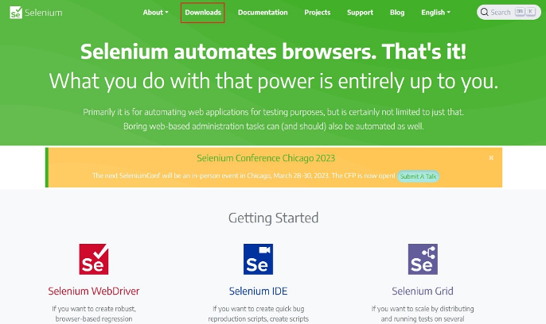

2. Click on the **download button** (circled in red ink in the above screen snapshot), and to go the page, which should look like the following.

    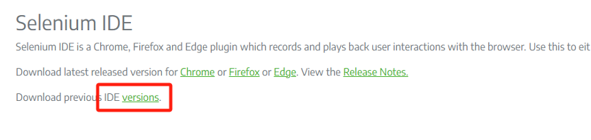
    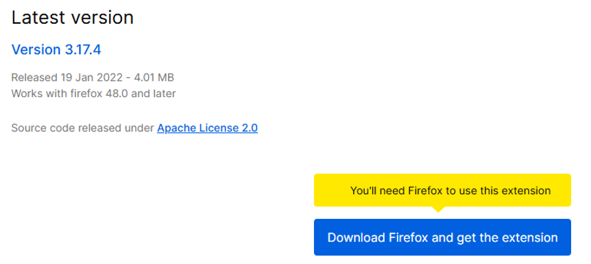

3. Click on the **Firefox** on the above page It will lead you to the following download page of Selenium. Now click on the button Add to Firefox to start downloading of the Selenium IDE and the installation the add-on to Firefox browser.

    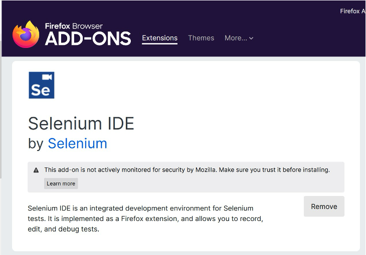

    ***Note***: If you see the message “This add-on is not compatible with your version of Firefox.” (see screens snapshot below), you need to install the latest version of Firefox; (earlier than Firefox 55). Once you installed it on your machine, **disable the automatic update** function of Firefox so that it will not be updated to the latest version unnoticed.

4. A successful installation will add a Selenium IDE button on the right top corner of the Firefox browser window, as indicated in the above screen snapshot. If it does not add the button, you need to use the customization function of Firefox to add it manually.

    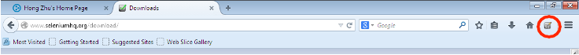

:::

## Task 2: Using Selenium IDE to Record Manual Testing

By completing this task, you will learn how to use Selenium IDE to record a manual test of a web- based application as a test script and to replay the test automatically by running the recorded test script. 

:::steps{title=""}

1. Open the web application to be test. Open the website in the Firefox web browser (The browser of your choice). The URL is: https://www.manchester.ac.uk We will use this website as an example.

2. Start recording the manual testing activities.

    Click on the Selenium IDE button on the right-up corner of the window.

    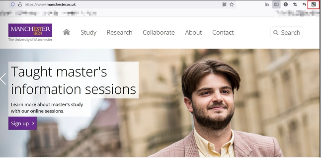

    When you clicked on the Selenium IDE button, there will be a new window for the Selenium IDE. It means you should build a project and named (Like the picture below).

    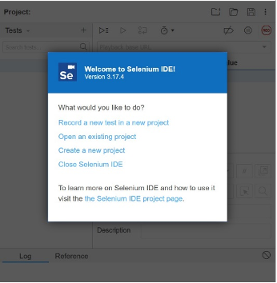

    When you finished it, the following Selenium IDE window will open. Note that the record button (circled in red ink in the screen snapshot) should be in the **on** state. Otherwise, click it to turn it on. This will enable you to record your manual interactions with the browser.

    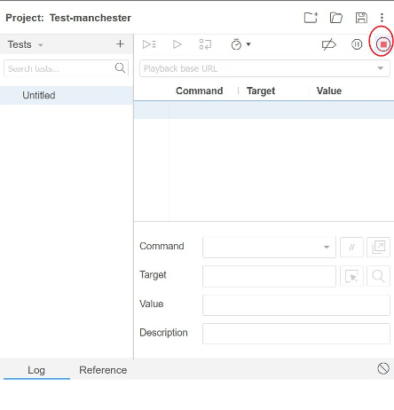

3. Perform manual testing.

    Perform some interface actions on the web page and observe what happens to the Selenium IDE screen. For example, the following is a sequence of actions on the this website.

    - Click on the “Study” tab. some information about study will be displayed in the frame
    - Click on the link “undergraduate” à the window will display a new page about the undergraduate.
    - Click on the link “Course” on the left side of the window  the window will display a new page showing the course for 2022 entry and 2023 entry.

    - Click on the 2022 entry button in the screen. You can see many course on the new page.  Now, have a look at the Selenium IDE window. You should have the following items listed in the recorded test script.

    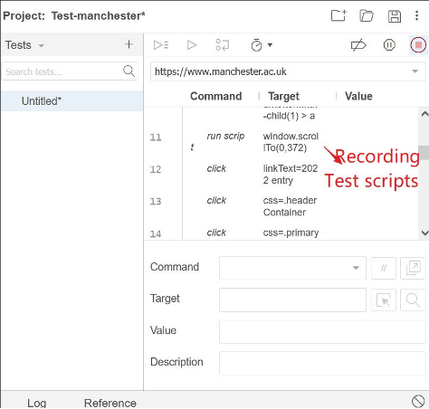

4. Stop recording when one manual test case is completed.
    
    Now, click on the record button of the Selenium IDE window to stop recording. Further interface actions performed on the web page will not change the recorded list of activities.

5. Replay a recorded test script.
    
    Now, you can reply the recorded test script by click on the run selected test button, which is indicated in red ink in the following screen snapshot.

    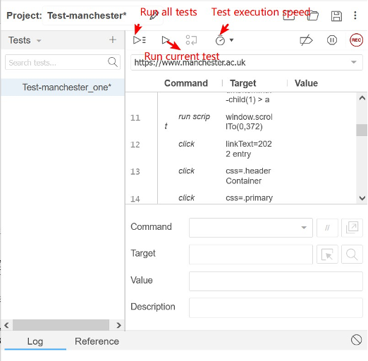

    - Click on the **run selected test** button in the Selenium IDE window and watch what is happening in the window of the web application. Make sure the window is open and that you can see the window.
    - The executions of a test script are logged by Selenium IDE and displayed in its window. In particular, error messages are displayed there.
    - Depending on the speed of your network connection, you may have or no errors in executing the test script. For example, the download of a short video may take longer than the default wait time between the steps.
    - The time that a web page is displayed during the execution of the test script may be too short for you to check the correctness of the contents of the page. In that case, you can adjust the time that each page is displayed by change the speed of testing.
    - You can also use the run all test scripts facility to run a number of test scripts in a one after another manner.

6. Create a new test case.
    
    Each test case should represent one complete test of a functionality of the web-based application. For each function of a web application, we usually need multiple test cases to test the function in different use cases and in different scenarios. 

    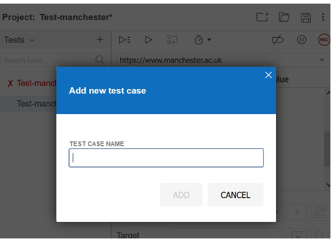

    Repeat the above steps to create a new test cases on the following uses of the web application:

:::

## Task 3: Work with a Test Suite

A test suite consists of a set of test cases for testing a web application. By grouping a set of test cases together can improve test efficiency and ease the management of test cases. Selenium IDE provides a facility for creating and executing test suites.

:::steps{title=""}

1. To create and save a set of test cases as a test suite, follow the steps below:

    - Select the **Test suites** menu 
    - Add tests to your Test suites 
    - Rename Test suites and save
    - Close the Selenium IDE

    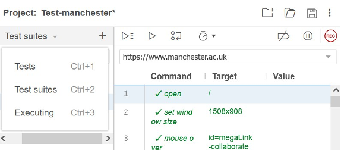

2. To load and execute a test suite

    - In the Firefox browser, click on the **Selenium IDE** button to open the Selenium IDE window.
    - Select the file that contains a test suite and open it. The test suite will be loaded to the IDE window.

3. To execute a test suite, just click the **Run all tests** button in the Selenium IDE window.

:::

## Further Exploration of Selenium IDE

After the practical class, further explore the functionality of Selenium IDE to find out how to do the following:
- Pause the execution of a test script in the middle of a test execution and then resume the test;
- Set and clear a break point in a test script, and execute the test script to the breakpoint and resume the test execution from a break point.

***Note***: Your recorded test scripts may fail for some reasons. Do not worry at this moment. We will address this problem in the next weeks’ practical classes.

**Introduce Interface of Selenium IDE:**

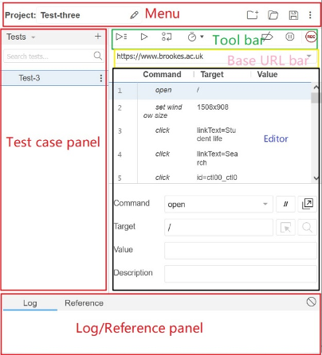
