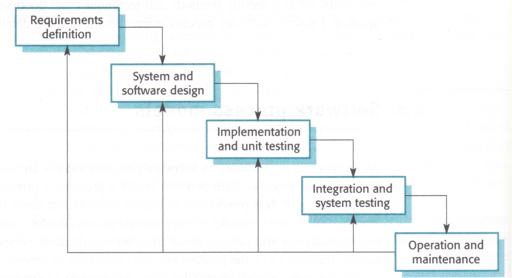
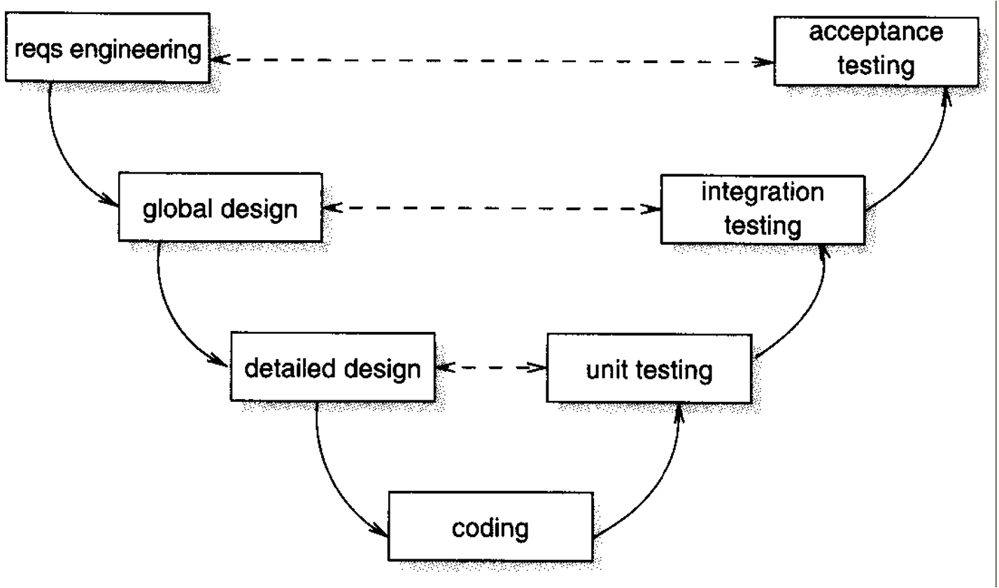
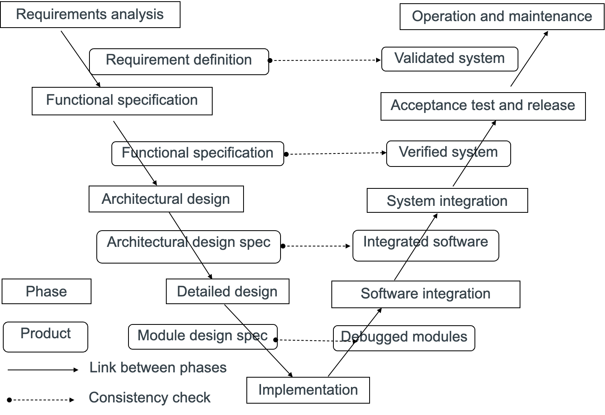
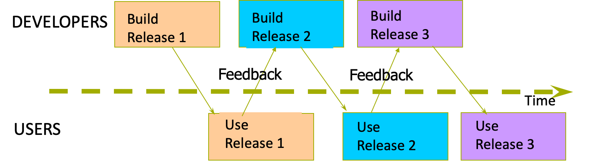
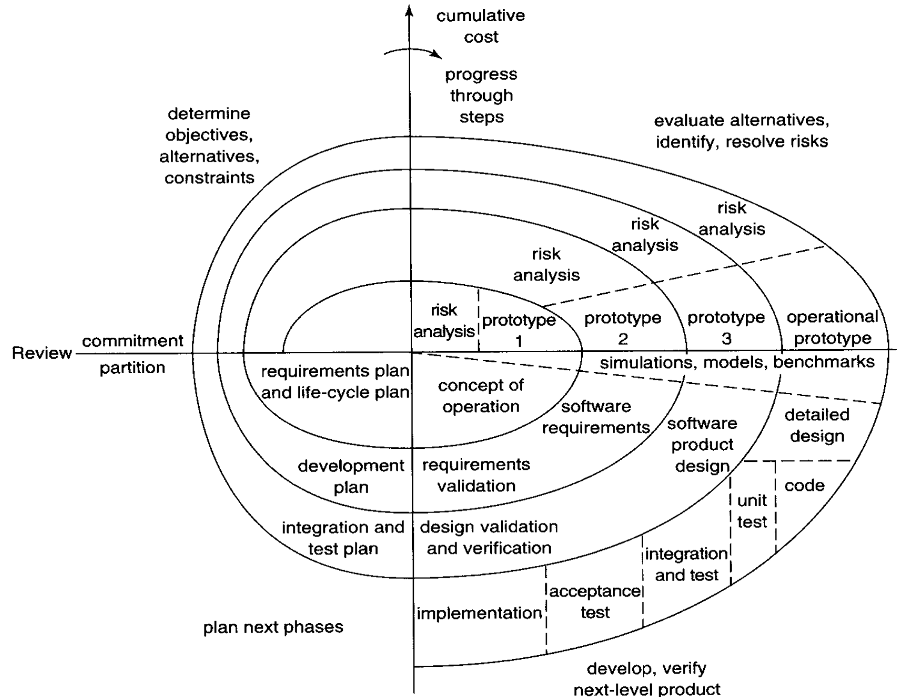
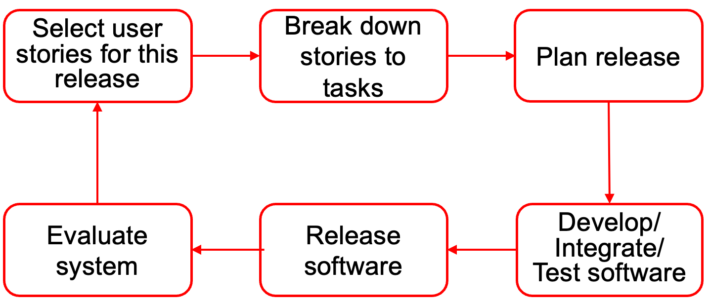

## This Week’s Learning Outcomes

- Lehman Theory of Software Evolution
    - Classification of software systems
    - Principle of software uncertainty
    - Laws of software evolution
- Software Process Models
    - What is a software process model
    - Typical SW process models
        - Waterfall / V model
        - Spiral
        - RAD
        - Agile: Extreme Programming, Scrum
    - How to select a process model

## Part 1 Lehman Theory

### Lehman Theory of Software Evolution

**Meir "Manny" Lehman** 

FREng

24/01/1925 – 29/12/2010

Professor in the School of Computing Science 
Middlesex University. 

From 1972 to 2002, 
Professor and Head of the Computing Department 
Imperial College London.

### Components of Lehman Theory

|                                    | What kind of software will evolve?                                                         |
| ---------------------------------- | ------------------------------------------------------------------------------------------ |
| Classification of software systems | - A classification of software systems   - The characteristics of software that evolves |

|                                       | Why does software evolve?                                                                                                        |
| ------------------------------------- | -------------------------------------------------------------------------------------------------------------------------------- |
| Uncertainties in software development | - The notion of software uncertainty   - The role of uncertainty in SW evolution   - A classification of uncertainties  |

|                            | How does SW evolve?                                                        |
| -------------------------- | -------------------------------------------------------------------------- |
| Laws of software evolution | - A set of laws of software evolution process as characteristic properties |

### Lehman’s Classification of Software

- S-type Programs (“Specifiable”)
    - *Problem to be solved*: can be stated formally and completely
    - *Acceptance of a solution*: correct if it meets its specification
- P-type Programs (“Problem-solving”)
    - *Problem to be solved*: Firm statement of a real-world problem (*may be incomplete*)
    - *Acceptance of a solution*: Judged by users’ satisfaction
- E-type Programs (“Embedded”)
    - *Problem to be solved*: A system that becomes part of the world that it models
    - *Acceptance of a solution*: depending entirely on human opinion & judgement

### Example: Game Software

- S-Type: 
    - Lays the chess board in a GUI;
    - Enables two human players to play the chess; 
    - Check if each move by the user is valid;
    - To determine who is the winner. 
- P-Type:
    - Plays the chess game against one human player with the goal of winning the game;
    - Display the chess board in a GUI;
    - Enable the human player to make moves on the GUI, checking the validity of the moves. 
- E-Type:
    - A game that enables two human players to play against each other
    - To attract as many people as possible to use the software

### Evolutionary Characteristics

- *S-type* software does not evolve
    - A change to the specification defines a new problem, hence a new program
- *P-type* software is likely to evolve continuously
    - The solution is never perfect, and can always be improved
    - The real-world changes and hence the problem changes
- *E-type* software is inherently evolutionary
    - Changes in the software and the world affect each other

### Lehman’s Theory of SW Uncertainty

- Notion of SW uncertainty
    - Software uncertainties are factors that cannot be accurately predicted and cannot be completely controlled in advance, but they have impact software development processes and it outcomes. 
- Principle of SW uncertainty
    - Uncertainty is present in all software development. 
    - The specific uncertain factors and their presentation forms are also uncertain, i.e. cannot be accurately predicted and completely controlled. 
- Implications
    - Uncertainty is the cause of software change, i.e. it is the driving force of software evolution
    - Software development techniques, methods and tools should be developed (and have been developed) to deal with uncertainty 

### Types of Software Uncertainty

Lehman identified three types of SW uncertainties
- Gödel-like uncertainty
    - They arise because software systems are models
    - The representation of a model and its relationship to the real world is Gödel incomplete
    - The properties of a program cannot be completely known
- Heisenberg-like uncertainty
    - Using a system inevitably change the user’s perception and understanding of the application
    - Common phenomena:
        - Users’ uncertainty about requirements (I’ll know it when I see it. ) 
        - changing requirements
- Pragmatic uncertainty
    - Human errors and risks due to:
        - the adaptation of a new development method 
        - the use of a new software tool or programming language, etc. 

#### Example 1: Online Banking (1)

- The Scenario 
    - Time: year 2000, when online banking were first introduced 
    - Situation: 
        - Online banking are novel to the users
        - Users have used high street bank branches for many decades and telephone banking for about 10 years
- Heisenberg-type uncertainty 
    - Assumptions are made based on the knowledge of customer’s habits in using local branches and telephone banking facilities
        - Online banking websites close at night
        - Each account is associated to a high street branch
        - Access only to the accounts in the same bank
    - Users’ understanding of e-banking systems and their way of banking started to change once they used e-banking
        - The busiest time for online banking is around 8pm ~10pm
        - Requirements on transactions involve multiple accounts from different banks

#### Example 1: Online Banking (2)

- Gödel-like uncertainty
    - The requirements definition of the system was based on the document of telephone banking system and traditional requirements definition that consists of a list of statements of functional and non-functional requirements. 
    - There are few mature theories and methods that help developers to give good statements on the following issues
        - Execution on distributed, hypermedia, heterogeneous computer platform 
        - Open environment, hence vulnerable to malicious attacks
        - Unreliable hardware and software resources; 
            - have to be fault tolerant and 
            - cooperative to other systems (existing systems of banking)
    - The model has high complexity due to, but mostly not well stated:
        - Complicated business logics 
        - Complicated enterprise organizational structures and operational processes
        - Concurrency in data processing
        - Code and data are mixed up

#### Example 1: Online Banking (3)

- Pragmatic uncertainty 
    - Technology and tools
        - Web technology rapidly developed in the past a few years and changed frequently
        - A large number of new techniques emerged
- Human factors
    - A large number of persons have entered the IT profession without proper qualification
    - Many of them have limited education, experience and training 
    - Constantly under the pressure of time-to-market
    - Large human resource turnover =&gt; lost knowledge of the system

#### Example 2: AI Applications (1)

- Pragmatic Uncertainty
    - Human errors
        1. Errors in the selection of the training data 
        2. Errors in the fine-tuning of parameters 
        3. Errors in the selection of machine learning models
    - Technical risks
        1. AI techniques such as machine learning, data analytics, are new to software engineers
        2. Large volume of sample data are required 
            1. Collecting, storing and processing big data 
            2. Combination of AI with cloud, fog and edge computing
            3. Integration with Internet-of-Things

#### Example 2: AI Applications (2)

- Godel type of uncertainty 
    - Untestable and unverifiable specifications
        - Requirements statements for AI applications are almost always not testable, i.e. not clear enough to design test cases, check test results, and decide when to stop testing 
    - Design models are not available
    - Incomprehensible results
        - Results of machine learning using Artificial Neural Network cannot be explained and not comprehensible

#### Example 2: AI Applications (3)

- Heisenberg type uncertainties: 
    - Software system’s adaptive behavior
        - Examples: 
            - Chatbots: Runtime machine learning
            - Data centres’ operation optimization, dynamic building models of workload
- Unknow impacts to human users as individuals as well as to the society 
    - Examples: 
        - Cambridge Analytics’ use of Facebook data and facility for political campaign
        - “Change Face”: a mobile app enables the user to changes an actor’s face in a video clip to someone else’s face. What are the social impacts? 

### Relationship of Uncertainty to SW Types

|        | Pragmatic | Gödel-like | Heisenberg-like |
| ------ | --------- | ---------- | --------------- |
| S-Type | +         | -          | -               |
| P-Type | +         | +          | -               |
| E-Type | +         | +          | +               |

#### Example 1: Online banking system 

- Typical “embedded” type of problem-solution characteristics
- Strongly influenced by all three types of uncertainties 
- Thus, it belongs to E-type, subject to continuous evolution
- Reality: 
    - Online banking system evolved rapidly and continuously by introducing new functions 
    - Online banking system changes human behaviours and society significantly 
    - New type of “online banking” systems occurred, e.g. PayPal
- Prediction by Lehman theory: 
    - More changes to come in the near future, e.g. crypto-currency

#### Example 2: AI Applications

- Typical “problem solving” or “embedded” type of application
- Strongly influenced by all three types of uncertainties
- Thus, they are mostly E-type 
- Prediction: 
    - AI applications are inevitably inherently evolutionary. 

> But, AI applications have some features more complicated!

### Algorithmic Uncertainty: A New Type

- ***Definition***: Algorithmic uncertainty is the uncertainty caused by employing randomness in the algorithms in the development and/or operation of the application
- ***Observation***: Almost all AI software employs algorithms with randomness to achieve adaptive behavior in complex environment
    - Neural networks: random initial weight of connections between neurons
    - Genetic algorithms: random selection of subset of subjects for generation of mutants
    - Multi-agent systems: randomness/non-deterministic interactions between agents
    - Formal/symbolic reasoning and expert systems: heuristic rules for applying reasoning rules

### Lehman’s Laws of SW Evolution

| Law                          | Description                                                                                                                                                                            |
| ---------------------------- | -------------------------------------------------------------------------------------------------------------------------------------------------------------------------------------- |
| Continuing Change            | E-type systems must be continually adapted; otherwise, they become progressively less satisfactory in use.                                                                             |
| Increasing Complexity        | As an E-type system is evolves, its complexity increases unless work is done to maintain or reduce it.                                                                                 |
| Self regulation              | E-type system evolution processes are self regulating.                                                                                                                                 |
| Organizational   Stability   | The average rate of effective global activity in an evolving E-type system tends to remain constant over product lifetime (provided that there is an appropriate feedback mechanisms). |
| Conservation of  familiarity | The incremental growth and long term growth rate of E-type systems tend to decline.                                                                                                    |
| Continuing Growth            | The functional capability of E-type systems must be continually increased to maintain user satisfaction over the system lifetime.                                                      |
| Declining Quality            | The quality of E-type systems will decline unless they are rigorously adapted, as required, to take into account changes in the operational environment.                               |
| Feedback System              | E-type evolution processes are multi-level, multi-loop, multi-agent feedback systems.                                                                                                  |
| Diversity                    | An E-type system contains components that are developed and integrated into the system using a diversity of techniques.                                                                |

## Part 2 Software Processes

### Software Processes

SW development & evolution is a complicated process
- Involves many **stakeholders**
    - Users, client
    - Developers, e.g. requirements analysist, SW architect, programmer, testers, quality engineers
    - Managers, e.g. project manager, team leader
    - Regulatory bodies, e.g. government authority, etc. 
- Consists of a set of interrelated **activities**
    - Constructive activities: e.g. design, coding 
    - Quality assurance activities: e.g. testing, measurement
    - Management activities: e.g. set project budget
- Produces and uses a variety of **artifacts**
    - Input: e.g. document of user’s requirements 
    - Deliverables: e.g. executable code
    - Internal: e.g. bug report 

#### Software Process Models

Software development (including operation, maintenance and evolution) process must be organised to deal with uncertainty effectively and efficiently.

- What is a process model 
    - A simplified representation of a software process, usually presented from a specific perspective
    - An abstract representation of a set of software processes with emphasis on certain high-level management decisions
- Typical examples
    - Waterfall model / V model
    - Spiral model
    - Component-based SD models
    - Agile models
    - DevOps

Software process models are summaries of successful experiences in the organisations of software processes, and thus provide guidance for new project.

### Waterfall Model

The process proceeds in sequence from one phase to another. Once the key deliverables of one phase are complete the phase ends and next phase begins

It is possible to go backward in the development process (e.g., going back from design to analysis phase) but backward process is costly

#### When to Use the Waterfall Model

- For straight forward (low risk) applications When applications are well understood
- Experienced staff familiar with development technology and SW environment Experienced staff are more likely to foresee the technical problems
- Clear existing and known requirements The most common reason for backtracking is incomplete or misunderstood requirements
- When requirements are unlikely to change

### The V Model

#### The V Model Redefined

### Rapid Application Development (RAD)

- Decompose whole system into a number parts
- Develop some parts of systems quickly and give them to users for feedback
    - Often use prototypes to obtain user feedback
        - Throwaway prototyping
        - Evolutionary prototyping 

### Prototyping

<b>Advantages</b>
1. Caters for uncertain requirements
    - Helps to confirm functional requirements
    - Helps to clarify non-functional requirements
2. Facilitates end-user involvement
    - Improves the usability of the system
<b>Disadvantages</b>
3. Harder to control budgets (how many times do we iterate?)
4. Danger of "requirements drift" (the final system may be different from what was originally anticipated)

### Boehm’s Spiral Model

### The Philosophy of Agile Methods

<b>Manifesto for Agile Software Development</b>

We are uncovering better ways of developing software by doing it and helping others do it. Through this work we have come to value:
- Individuals and interactions over processes and tools
- Working software over comprehensive documentation
- Customer collaboration over contract negotiation
- Responding to change over following a plan
That is, while there is value in the items on the right, we value the items on the left more.

#### Examples of Agile Methods

- **Extreme programming**
- **Scrum**
- Crystal
- Adaptive Software Development
- DSDM
- Feature Driven Development

### Extreme Programming

- Requirements are expressed as use cases and scenarios (called **user stories** in XP) 
- User stories are break down into implementation **tasks**
- Programmers **work in pairs** to perform tasks
- For each task, programmers develop **tests before coding**
- **All tests must be successfully** executed when new code is integrated into the system
- There is a **short time gap** between releases of the system

### Release Cycle of XP

### Test Driven Development

- Evolved from the test-first programming concepts of XP
- Encourages simple designs and inspires confidence
- The development process 
    - Writing automated test cases to represent new functions of a system to be developed 
    - Producing the minimum amount of code to pass that test 
    - Refactoring the new code to an acceptable standard for release
- Tool support
    - XUnit architecture of automated testing framework
- Kent Beck is credited with having 'rediscovered' the technique

### "Test twice, code once"

The key rule of TDD is summarized as *“test twice, code once”* by analogy to the carpenter’s rule of “measure twice, cut once”.  
- Write a test of the new code and see it fails
- Write the new code, doing “the simplest thing that could possibly work.”
- See the test succeeds, and refactor the code

> Kent Beck, <i>Test-Driven Development by Example</i>, Addison-Wesley, 2003.

### XUnit

- The family of testing tools:
    - Sunit, the first of this kind for TDD in SmallTalk, designed by Kent Beck in 1998
    - JUnit for supporting test driven development in Java
    - CppUnit for C++
    - PyUnit for Python
    - PHPUnit for PHP
    - and many others

> Paul Hamill, <i>Unit Test Frameworks</i>, O’Reilly, 2005.  
> A list of XUnit tools on wikipedia: https://en.wikipedia.org/wiki/List_of_unit_testing_frameworks 

### Scrum Terminology (1)

- Scrum master responsibilities:
    - implement the scrum process
    - coach the development team
    - remove any impediment in the development process
    - enable an interaction between outside world and the team
- Product owner responsibilities:
    - represent the customer in the software development
    - compile and prioritise all the changes for the product
    - maintain product backlog
- Scrum Team:
    - 5 – 9 full time members  
    - with specific expertise but no specific roles
    - members are cross functional
    - members are self organising and have joint responsibility

### Scrum Terminology (2)

- Product backlog:
    - managed by the product owner
    - includes different items such as lists of tasks or users stories
    - includes To-Do list of tasks. This lists is constantly updated and its tasks are prioritized
- Sprint
    - In scrum, tasks are performed in terms of sprints
    - Each sprint has a duration and is generally of two to four weeks
    - Though scrum allows changes in requirements it does not allow changes during mid-sprint
    - Working software is delivered at the end of each sprint

### Scrum Terminology (3)

- Stand-up meeting
    - a daily meeting attended by all team members and maybe users.
    - Team members have to answer the following questions
        - What have you done since yesterday?
        - What are you planning to do today?
        - Are there any impediments?

### Choosing a Methodology

<b>Methods from Textbooks</b>

- Type of system: 
    - real time (mission critical), single or multi-user, single or multi-platform
- Time to market:
    - Fast release, to meet business needs in a short time
- Changing requirements: 
    - How quickly will requirements change?
- User involvement: 
    - Are users to be involved in the design and development process?

---

<b>Application of Lehman Theory</b>

- Identify the uncertainties underlying the software
    - For each type of uncertainty, identify the most likely form of uncertainty factors
- Determine the type of software according to the dominant type of uncertainties
    - See table on Slide 16
- Select the development process 
    - Waterfall, V model: for S-Type software, with low technical risks in the pragmatic type of uncertainty 
    - Spiral: for S-Type software, with high technical risks in the pragmatic type of uncertainty
    - RAD (prototype): for P-type software, with Godel-like uncertainty as the dominant type of uncertainty
    - Agile: for E-type software, with Heisenberg-like uncertainty as the dominant type of uncertainties

## This Week’s Study Guide

**Further Readings**
- Hughes, Cotterell, Software Project Management, 4th edition, (Chapters 3 and 4)
- Sommerville, Software Engineering, 9th ed. (Chapters 1 and 2)

**Coursework**
- Read the coursework specification 
    - Understand the nature of work 
    - Understand the tasks to be completed
    - Understand the work to be submitted 
- Read the coursework case study description
    - Analyse the uncertainties associated to the project
    - Select an appropriate process model for the coursework project
- Team building of coursework group
    - Join a team of 4 students
    - Exchange contact details
    - Set the collaboration mechanism 

Source: [chc6173-2022-lecture-1-software-evolution-and-process-models.pptx](https://view.officeapps.live.com/op/view.aspx?src=https%3A%2F%2Fvle.zycdut.net%2Fsites%2Fstudent.zy.cdut.edu.cn%2Ffiles%2Fattachments%2Fchc6173-2022-lecture-1-software-evolution-and-process-models_3.pptx&wdOrigin=BROWSELINK)
